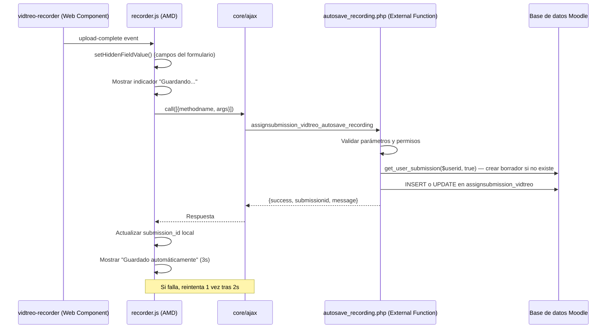
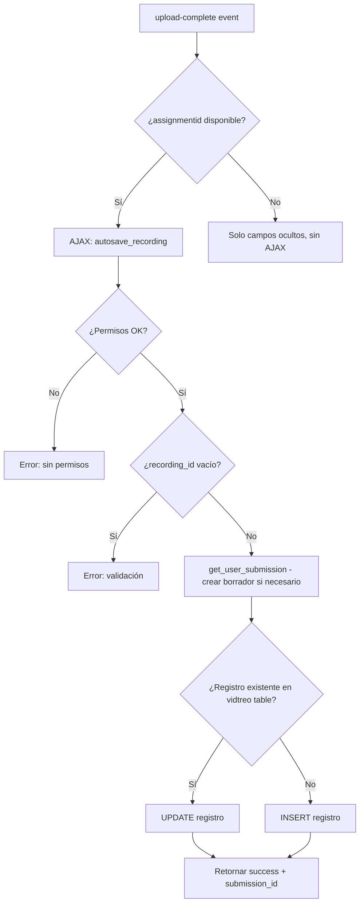

# Diseño Técnico: Auto-guardado de Video

## Resumen

Esta funcionalidad agrega un mecanismo de auto-guardado vía AJAX al plugin `assignsubmission_vidtreo` de Moodle. Cuando el componente web `vidtreo-recorder` emite el evento `upload-complete`, el frontend invoca automáticamente un servicio web externo de Moodle que persiste los datos de la grabación como borrador, sin requerir que el estudiante envíe el formulario manualmente.

El diseño sigue el patrón oficial de AJAX de Moodle: el módulo AMD `amd/src/recorder.js` usa `core/ajax` para llamar a una función externa registrada en `db/services.php`, que a su vez delega la lógica a una clase en `classes/external/autosave_recording.php`.

## Arquitectura



### Decisiones de diseño

1. **Reutilizar `get_user_submission($userid, true)`**: Moodle ya provee este método en `mod_assign` para crear un borrador si no existe. Evitamos duplicar lógica.

2. **Upsert en la tabla vidtreo**: El mismo patrón que usa `save()` en `locallib.php` — buscar registro existente por `submission`, actualizar si existe, insertar si no. Esto garantiza idempotencia.

3. **Un solo reintento tras fallo**: Balanceo entre resiliencia y no saturar el servidor. Si falla dos veces, se muestra el error al usuario.

4. **No modificar `save()` en locallib.php**: El método `save()` ya hace upsert, así que funciona correctamente tanto si el auto-guardado ya persistió datos como si no.

## Componentes e Interfaces

### 1. Clase externa: `autosave_recording.php`

**Ubicación**: `classes/external/autosave_recording.php`
**Namespace**: `assignsubmission_vidtreo\external`
**Clase**: `autosave_recording` extiende `\core_external\external_api`

```php
// Parámetros de entrada
public static function execute_parameters(): external_function_parameters {
    return new external_function_parameters([
        'assignmentid' => new external_value(PARAM_INT, 'Assignment ID', VALUE_REQUIRED),
        'recordingid'  => new external_value(PARAM_TEXT, 'Vidtreo recording ID', VALUE_REQUIRED),
        'publicid'     => new external_value(PARAM_TEXT, 'Vidtreo public ID', VALUE_REQUIRED),
        'duration'     => new external_value(PARAM_INT, 'Duration in seconds', VALUE_DEFAULT, 0),
        'status'       => new external_value(PARAM_TEXT, 'Recording status', VALUE_DEFAULT, 'complete'),
        'metadata'     => new external_value(PARAM_RAW, 'JSON metadata', VALUE_DEFAULT, ''),
    ]);
}

// Retorno
public static function execute_returns(): external_single_structure {
    return new external_single_structure([
        'success'      => new external_value(PARAM_BOOL, 'Operation success'),
        'submissionid' => new external_value(PARAM_INT, 'Submission ID'),
        'message'      => new external_value(PARAM_TEXT, 'Status message', VALUE_OPTIONAL),
    ]);
}
```

**Lógica de `execute()`**:
1. Validar parámetros con `self::validate_parameters()`
2. Obtener el contexto del módulo desde `assignmentid` (vía `get_coursemodule_from_instance`)
3. Verificar capacidad `assignsubmission/vidtreo:use` con `require_capability()`
4. Validar que `recordingid` no esté vacío (después de `trim()`)
5. Obtener o crear borrador con `$assign->get_user_submission($USER->id, true)`
6. Buscar registro existente en `assignsubmission_vidtreo` por `submission`
7. INSERT o UPDATE según corresponda
8. Retornar `{success: true, submissionid: $submission->id}`

### 2. Registro del servicio: `db/services.php`

```php
$functions = [
    'assignsubmission_vidtreo_autosave_recording' => [
        'classname'     => 'assignsubmission_vidtreo\external\autosave_recording',
        'methodname'    => 'execute',
        'description'   => 'Auto-save video recording data as draft submission',
        'type'          => 'write',
        'ajax'          => true,
        'loginrequired' => true,
    ],
];
```

### 3. Modificación de `amd/src/recorder.js`

Se agrega una dependencia a `core/ajax` en el `define()` y una función `performAutosave()` que:

- Recibe los datos del evento `upload-complete` y el `assignmentid` (pasado desde la config)
- Muestra el indicador de auto-guardado ("Guardando...")
- Llama a `Ajax.call([{methodname: 'assignsubmission_vidtreo_autosave_recording', args: {...}}])`
- En éxito: actualiza el `submission_id` local, muestra "Guardado automáticamente" por 3 segundos
- En fallo: reintenta una vez tras 2 segundos; si falla de nuevo, muestra error

La función se invoca dentro del handler existente de `upload-complete`, después de `setHiddenFieldValue()`.

### 4. Modificación de `templates/recorder.mustache`

Se agrega un elemento para el indicador de auto-guardado:

```html
<div class="vidtreo-autosave-status" style="display: none;" data-region="vidtreo-autosave-status">
    <span class="vidtreo-autosave-message"></span>
</div>
```

Ubicado después del bloque `.vidtreo-upload-status`.

### 5. Modificación de `version.php`

Incrementar `$plugin->version` para que Moodle descubra el nuevo servicio en `db/services.php` al actualizar el plugin.

### 6. Cadenas de idioma

**Nuevas cadenas** en `lang/en/assignsubmission_vidtreo.php` y `lang/es/assignsubmission_vidtreo.php`:

| Clave | EN | ES |
|---|---|---|
| `autosave:saving` | Saving... | Guardando... |
| `autosave:saved` | Auto-saved successfully | Guardado automáticamente |
| `autosave:error` | Auto-save failed: {$a} | Error al guardar automáticamente: {$a} |
| `autosave:error_validation` | Invalid recording data | Datos de grabación inválidos |
| `autosave:error_permission` | You do not have permission to save | No tienes permiso para guardar |

## Modelo de Datos

### Tabla existente: `assignsubmission_vidtreo`

No se requieren cambios en el esquema. La tabla ya contiene todos los campos necesarios:

| Campo | Tipo | Descripción |
|---|---|---|
| `id` | int(10) | Clave primaria |
| `assignment` | int(10) | FK a `assign.id` |
| `submission` | int(10) | FK a `assign_submission.id` (índice único) |
| `recording_id` | char(255) | ID de grabación Vidtreo |
| `public_id` | char(255) | ID público para reproducción |
| `duration` | int(10) | Duración en segundos |
| `status` | char(20) | Estado: pending, complete, error |
| `metadata` | text | JSON con metadatos adicionales |

### Flujo de datos del auto-guardado



### Parámetros pasados al JS

El objeto `config` que se pasa a `recorder.js` desde `locallib.php` necesita incluir el `assignmentId` para que el frontend pueda enviarlo en la solicitud AJAX. Actualmente ya incluye `submissionId`; se agrega `assignmentId`.

```php
// En locallib.php get_form_elements(), agregar al array $config:
'assignmentId' => $this->assignment->get_instance()->id,
```


## Propiedades de Correctitud

*Una propiedad es una característica o comportamiento que debe cumplirse en todas las ejecuciones válidas de un sistema — esencialmente, una declaración formal sobre lo que el sistema debe hacer. Las propiedades sirven como puente entre especificaciones legibles por humanos y garantías de correctitud verificables por máquina.*

Las siguientes propiedades se derivan del análisis de los criterios de aceptación del documento de requisitos. Los criterios no testables como propiedades (indicadores visuales UI, estructura de registro de servicio, comportamiento de retry) se cubren mediante tests unitarios de ejemplo o verificación manual.

### Propiedad 1: Round-trip de auto-guardado (upsert idempotente)

*Para cualquier* conjunto válido de datos de grabación (recording_id no vacío, public_id, duration, status, metadata) y cualquier assignment válido con un usuario con permisos, llamar a `autosave_recording::execute()` debe resultar en exactamente un registro en `assignsubmission_vidtreo` para esa entrega, y los campos del registro deben coincidir con los datos proporcionados. Llamar a `execute()` una segunda vez con datos diferentes debe actualizar el registro existente sin crear un duplicado.

**Validates: Requirements 2.3, 2.4, 2.5, 3.3**

### Propiedad 2: Control de permisos

*Para cualquier* usuario y assignment, el resultado de `autosave_recording::execute()` debe ser exitoso si y solo si el usuario tiene la capacidad `assignsubmission/vidtreo:use` en el contexto del módulo. Si el usuario no tiene la capacidad, la tabla `assignsubmission_vidtreo` no debe ser modificada.

**Validates: Requirements 2.2, 2.6**

### Propiedad 3: Gestión de borrador de entrega

*Para cualquier* usuario y assignment, después de una llamada exitosa a `autosave_recording::execute()`, debe existir exactamente una entrega (submission) en estado borrador para ese usuario y tarea, independientemente de si la entrega existía previamente o fue creada por el auto-guardado.

**Validates: Requirements 3.1, 3.2**

### Propiedad 4: Validación de recording_id vacío

*Para cualquier* cadena compuesta enteramente de espacios en blanco (incluyendo la cadena vacía), `autosave_recording::execute()` debe rechazar la solicitud con un error de validación y no modificar la tabla `assignsubmission_vidtreo`.

**Validates: Requirements 2.7**

### Propiedad 5: Compatibilidad autosave → save() (sin duplicados)

*Para cualquier* conjunto válido de datos de grabación, si `autosave_recording::execute()` se ejecuta primero y luego `save()` de `assign_submission_vidtreo` se ejecuta con la misma entrega, debe existir exactamente un registro en `assignsubmission_vidtreo` para esa entrega (sin duplicados), y los datos deben reflejar los valores más recientes proporcionados a `save()`.

**Validates: Requirements 6.1**

### Propiedad 6: Compatibilidad retroactiva de save()

*Para cualquier* conjunto válido de datos de grabación, si `save()` de `assign_submission_vidtreo` se ejecuta sin un auto-guardado previo, el comportamiento debe ser idéntico al actual: se crea un registro nuevo si no existe, o se actualiza si ya existe.

**Validates: Requirements 6.2**

## Manejo de Errores

### Errores del backend (autosave_recording.php)

| Escenario | Comportamiento | Código/Excepción |
|---|---|---|
| Usuario sin capacidad `assignsubmission/vidtreo:use` | Lanzar `required_capability_exception` | Moodle maneja automáticamente |
| `recording_id` vacío o solo whitespace | Retornar `{success: false, message: 'autosave:error_validation'}` | Sin excepción, respuesta controlada |
| Assignment no encontrado | Lanzar `invalid_parameter_exception` | Moodle maneja automáticamente |
| Error de base de datos | Excepción propagada por Moodle DML | Capturada por `core/ajax` |
| Sesión expirada | `loginrequired => true` rechaza la solicitud | Moodle retorna error de sesión |

### Errores del frontend (recorder.js)

| Escenario | Comportamiento |
|---|---|
| AJAX falla (red, servidor) | Reintentar 1 vez tras 2 segundos |
| Segundo intento falla | Mostrar error en indicador de auto-guardado |
| `assignmentId` no disponible en config | No intentar auto-guardado, solo campos ocultos |
| Respuesta con `success: false` | Mostrar `message` del servidor en indicador |

### Principio de diseño

El auto-guardado es un mecanismo de "mejor esfuerzo". Si falla, el flujo manual (enviar formulario) sigue funcionando porque los campos ocultos ya están poblados por el handler de `upload-complete`. El usuario siempre tiene el camino de respaldo.

## Estrategia de Testing

### Testing unitario

Los tests unitarios se enfocan en casos específicos, edge cases y verificaciones estructurales:

- **Estructura del servicio (Req 5.1, 5.3, 5.4)**: Verificar que `db/services.php` contiene la definición correcta con `ajax => true` y `loginrequired => true`.
- **Parámetros de la función externa (Req 5.2)**: Verificar que `execute_parameters()` y `execute_returns()` retornan las estructuras esperadas con los tipos correctos.
- **Indicador visual (Req 4.1, 4.2, 4.3)**: Verificación manual — el indicador muestra "Guardando...", "Guardado automáticamente" (3s), y mensajes de error.
- **Retry en frontend (Req 4.4)**: Test unitario JS verificando que tras un fallo se reintenta una vez después de 2 segundos.
- **Actualización de submission_id local (Req 1.3)**: Test unitario JS verificando que el submission_id se actualiza con el valor retornado por el servidor.
- **Primera entrega sin submission_id (Req 1.2)**: Test unitario JS verificando que el assignment_id se incluye en la solicitud cuando no hay submission_id.

### Testing basado en propiedades

Se usará **PHPUnit** con un generador de datos aleatorios personalizado (helper de test) para simular property-based testing, dado que el ecosistema PHP/Moodle no tiene una librería PBT estándar ampliamente adoptada. Cada test se configurará para ejecutar un mínimo de 100 iteraciones con datos generados aleatoriamente.

Alternativamente, si se dispone de **Eris** (librería PBT para PHP), se usará directamente.

Cada test de propiedad debe incluir un comentario de referencia al diseño:
- Formato: **Feature: video-auto-save, Property {number}: {property_text}**

**Tests de propiedad a implementar:**

1. **Property 1 — Round-trip upsert**: Generar datos de grabación aleatorios (recording_id, public_id, duration, status, metadata), ejecutar `autosave_recording::execute()`, verificar que el registro en BD coincide. Ejecutar de nuevo con datos diferentes, verificar que sigue habiendo un solo registro actualizado.

2. **Property 2 — Control de permisos**: Generar usuarios aleatorios con y sin la capacidad `assignsubmission/vidtreo:use`, ejecutar autosave, verificar que solo los usuarios con permisos logran persistir datos y que la tabla no se modifica para usuarios sin permisos.

3. **Property 3 — Gestión de borrador**: Generar escenarios con y sin submission preexistente, ejecutar autosave, verificar que siempre hay exactamente un borrador para el par usuario/tarea.

4. **Property 4 — Validación de recording_id**: Generar cadenas de solo whitespace de longitud aleatoria (incluyendo cadena vacía), verificar que todas son rechazadas y la tabla no se modifica.

5. **Property 5 — Compatibilidad autosave → save()**: Generar datos aleatorios, ejecutar autosave, luego ejecutar `save()` con datos potencialmente diferentes, verificar que existe un solo registro con los datos más recientes.

6. **Property 6 — Compatibilidad retroactiva**: Generar datos aleatorios, ejecutar `save()` sin autosave previo, verificar que el comportamiento es idéntico al actual (insert o update según corresponda).

### Cobertura de tests

| Propiedad / Test | Tipo | Criterios cubiertos |
|---|---|---|
| P1: Round-trip upsert | Property-based (100+ iter) | 2.3, 2.4, 2.5, 3.3 |
| P2: Control de permisos | Property-based (100+ iter) | 2.2, 2.6 |
| P3: Gestión de borrador | Property-based (100+ iter) | 3.1, 3.2 |
| P4: Validación de recording_id | Property-based (100+ iter) | 2.7 |
| P5: Compatibilidad autosave→save | Property-based (100+ iter) | 6.1 |
| P6: Compatibilidad retroactiva | Property-based (100+ iter) | 6.2 |
| Estructura de servicio | Unit test (example) | 5.1, 5.3, 5.4 |
| Parámetros de función externa | Unit test (example) | 5.2 |
| Retry en frontend | Unit test JS (example) | 4.4 |
| Indicador visual | Verificación manual | 4.1, 4.2, 4.3 |
| Actualización submission_id local | Unit test JS (example) | 1.3 |
| AJAX con datos correctos | Unit test JS (example) | 1.1 |
| Primera entrega sin submission_id | Unit test JS (edge-case) | 1.2 |
| Campos ocultos sincronizados | Unit test JS (example) | 6.3 |
