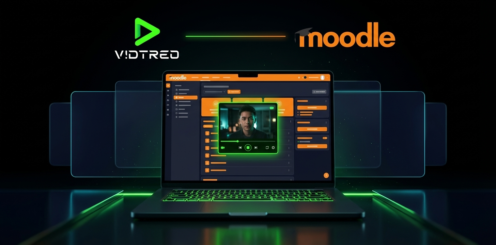

# 🎬 VIDTREO for Moodle



**Video recording for Moodle — Assignments and Quizzes. Record, submit, grade — without leaving Moodle.**

Students record video directly inside Moodle activities using VIDTREO Recorder. Teachers review recordings with VIDTREO Player in the grading view. Moodle handles the academic context. VIDTREO handles the video infrastructure.

No file uploads. No plugins to install on student devices. No downloads. Just click record.

---

## ⚡ What it does

- 🎥 **VIDTREO Recorder** embedded in Assignments and Quiz questions
- ▶️ **VIDTREO Player** embedded in the teacher's grading view and quiz review
- 📱 Works on desktop and mobile browsers
- 🌐 Multilingual UI (English, Spanish — more coming)
- 🔒 GDPR-ready with full Moodle Privacy API implementation
- 💾 Automatic backup/restore support for course migrations
- 🔌 Extensible subplugin architecture — add new modules without touching core
- 🎬 **Quiz question type** — Students record video answers directly in quiz attempts
- 👁️ **Video playback in quiz review** — Teachers can watch student videos when reviewing quiz attempts
- 🎨 **Custom question icon** — Visual indicator for video recording questions in question bank

---

## 🎓 How it works

### Student submits a video

```
📝 Open activity → 🎥 Record video → ☁️ Auto-upload → ✅ Submit
```

1. Student opens an Assignment or Quiz question with VIDTREO enabled
2. VIDTREO Recorder appears inside the activity form
3. Student records from camera or screen — with pause, mute, and device switching
4. Video uploads automatically to VIDTREO Edge API (browser-native transcoding, no server relay)
5. Student submits — Moodle saves the recording reference

### Teacher grades the video

```
📋 Open grading → ▶️ Watch video → ✏️ Grade
```

1. Teacher opens the submission in Moodle's grading view
2. VIDTREO Player loads inline — no external tabs, no downloads
3. Teacher watches, grades, and moves on

### Architecture split

Moodle stores **submission metadata** (recording ID, duration, status). VIDTREO stores **the actual video** on Cloudflare's global edge network. This keeps your Moodle server lean — no video files eating disk space.

---

## 🏗️ Plugin Architecture

This project consists of **three separate plugins** that work together:

### 1. `assignsubmission_vidtreo` — Legacy Assignment Plugin
The original plugin. Lives at `mod/assign/submission/vidtreo/`. Fully functional standalone for Assignment submissions.

### 2. `qtype_vidtreo` — Quiz Question Type Plugin *(new)*
A question type plugin that enables video recording questions in Moodle quizzes. Students record video answers directly in quiz attempts, and teachers can review them in the quiz review interface.

**Key features:**
- 🎥 Video recording directly in quiz questions
- ▶️ Video playback in quiz review for teachers
- 📝 Question text display with recording interface
- ⚙️ Configurable recording settings (max time, pause, source switching)
- 🎨 Custom icon in question bank
- 🔒 Manual grading workflow (requires teacher review)

### 3. `local_vidtreo` — Central Plugin + Subplugins
A local plugin that provides shared infrastructure and extends VIDTREO to multiple modules via a subplugin system.

```
local/vidtreo/                          # Central plugin (shared code)
├── classes/api_client.php              # Shared API client
├── classes/privacy/provider.php        # Centralized GDPR (covers all subplugins)
├── amd/src/recorder.js                 # Single recorder component
├── amd/src/player.js                   # Single player component
├── templates/recorder.mustache         # Shared recorder template
├── templates/player.mustache           # Shared player template
├── settings.php                        # Single config page (API Key, URLs, etc.)
├── db/subplugins.php                   # Declares the subplugin system
└── subplugins/
    └── vidtreosubmission/              # Assignment subplugin (migrated)
```

---

## 🚀 Installation

### Where each plugin goes in Moodle

```
{moodle_root}/
├── mod/assign/submission/vidtreo/      ← assignsubmission_vidtreo (this repo root)
├── question/type/vidtreo/              ← qtype_vidtreo (qtype_vidtreo/ folder of this repo)
└── local/vidtreo/                      ← local_vidtreo (local/ folder of this repo)
    └── subplugins/
        └── vidtreosubmission/
```

### Step 1: Install the plugins

**Option A — Manual copy:**
```bash
# Legacy assignment plugin (already works standalone)
cp -r . {moodle_root}/mod/assign/submission/vidtreo/

# Quiz question type plugin
cp -r ./qtype_vidtreo {moodle_root}/question/type/vidtreo

# New central plugin with subplugins
cp -r ./local/vidtreo {moodle_root}/local/vidtreo
```

**Option B — Upload ZIP** through **Site administration → Plugins → Install plugins**.

⚠️ **Important:** Install all three plugins for full functionality. The quiz question type requires `local_vidtreo` for shared components.

### Step 2: Complete setup

1. Visit Moodle as admin — the installation wizard runs automatically for both plugins
2. Go to **Site administration → Plugins → Local plugins → Vidtreo**
3. Configure your settings (one place, applies to all modules):

| Setting | Description | Default |
|---------|-------------|---------|
| 🔑 **API Key** | Your VIDTREO API key ([get one free](https://app.vidtreo.com)) | — |
| 🌐 **Backend URL** | VIDTREO Edge API endpoint | `https://core.vidtreo.com` |
| 📦 **Recorder CDN URL** | Recorder Web Component source | jsDelivr CDN |
| 📦 **Player CDN URL** | Player Web Component source | jsDelivr CDN |
| ⏱️ **Max recording time** | Default limit in seconds | `300` (5 min) |
| 🔄 **Source switching** | Allow camera ↔ screen toggle | ✅ Enabled |
| ⏸️ **Pause** | Allow pause/resume during recording | ✅ Enabled |

### Step 3: Enable on activities

**Assignments:**
1. Create or edit an assignment
2. Under **Submission types**, check **VIDTREO Recorder**
3. Save — students can now record video submissions

**Quiz:**
1. Edit a quiz → Add question → Select **Grabación de video Vidtreo** (VIDTREO video recording) question type
2. Configure the question:
   - **Question name**: Internal identifier for the question bank
   - **Question text**: The prompt students will see (e.g., "Explain the water cycle")
   - **Instructions** (optional): Additional guidance for students
   - **Max recording time**: Time limit in seconds (default: 300 = 5 minutes)
   - **Enable source switching**: Allow students to switch between camera and screen
   - **Enable pause**: Allow students to pause/resume recording
3. Save the question
4. Students will see the question text and recording interface when taking the quiz
5. Teachers can watch the recorded videos in the quiz review interface at `/mod/quiz/review.php`

**Grading video questions:**
- Video questions require manual grading (they don't auto-grade)
- Teachers access the grading interface from the quiz results page
- The video player appears inline with the question text
- Teachers can watch the video, add comments, and assign a grade
- The video player uses optimized styling to hide unnecessary black bars and center the video properly

---

## 🐳 Development with Docker

### Quick start

```bash
# Levantar el entorno completo
docker-compose up -d

# Acceder a Moodle
http://localhost:8080

# Ver emails capturados (MailHog)
http://localhost:8025
```

### Servicios incluidos

| Servicio | Puerto | Descripción |
|----------|--------|-------------|
| **Moodle** | 8080 | Aplicación principal |
| **MariaDB** | 3307 | Base de datos |
| **MailHog** | 8025 (web), 1025 (SMTP) | Servidor SMTP de prueba |

### Volúmenes Docker

El `docker-compose.yml` monta automáticamente ambos plugins:

```yaml
volumes:
  # Plugin legacy de Assignment
  - ./lib.php:/var/www/html/mod/assign/submission/vidtreo/lib.php
  - ./locallib.php:/var/www/html/mod/assign/submission/vidtreo/locallib.php
  # ... (resto de archivos del plugin legacy)

  # Plugin central local_vidtreo con subplugins
  - ./local/vidtreo:/var/www/html/local/vidtreo
```

### JavaScript en desarrollo

Moodle en producción usa los archivos minificados de `amd/build/`. Para desarrollo sin compilar:

```php
// En config.php de Moodle (ya configurado en docker-config.php):
$CFG->cachejs = false;
```

Para compilar para producción:
```bash
# Desde la raíz de Moodle
grunt amd --root=local/vidtreo
grunt amd --root=mod/assign/submission/vidtreo
```

### MailHog - Servidor de email para desarrollo

MailHog captura todos los emails enviados por Moodle sin enviarlos realmente. Perfecto para:

- ✅ Probar notificaciones de entrega de tareas
- ✅ Ver emails de confirmación a estudiantes
- ✅ Verificar formato y contenido de mensajes

**Interfaz web:** http://localhost:8025

### Comandos útiles

```bash
# Ver logs de Moodle
docker logs -f moodle_app

# Reiniciar servicios
docker-compose restart

# Detener todo
docker-compose down

# Limpiar todo (incluyendo datos)
docker-compose down -v
```

### 🐛 Herramientas de Debug

El plugin incluye herramientas de diagnóstico en la carpeta `debug/`. Deshabilitadas por defecto.

**Para habilitar:**
1. Edita `debug/config.php`
2. Cambia `VIDTREO_DEBUG_ENABLED` a `true`
3. Accede a `http://localhost:8080/mod/assign/submission/vidtreo/debug/`

⚠️ **Nunca habilites en producción.**

---

## 📁 Full project structure

```
moodle-assignsubmission-vidtreo/        (este repositorio)
│
├── version.php                         # Plugin legacy: assignsubmission_vidtreo
├── locallib.php
├── settings.php
├── lib.php
├── renderer.php
├── styles.css
├── amd/src/
│   ├── recorder.js
│   └── player.js
├── templates/
├── db/
├── classes/
├── backup/
├── tests/
├── lang/
│   ├── en/
│   └── es/
│
├── qtype_vidtreo/                      # Plugin nuevo: qtype_vidtreo (Quiz question type)
│   ├── version.php
│   ├── questiontype.php                # Question type definition
│   ├── question.php                    # Question behavior
│   ├── renderer.php                    # Question rendering (recorder + player)
│   ├── edit_vidtreo_form.php           # Question editing form
│   ├── pix/
│   │   └── icon.svg                    # Question type icon (camera)
│   ├── classes/
│   │   ├── external/
│   │   │   └── autosave_attempt.php    # Web service for autosave
│   │   └── privacy/provider.php        # GDPR compliance
│   ├── db/
│   │   ├── install.xml                 # Database schema
│   │   ├── access.php                  # Capabilities
│   │   └── services.php                # Web services
│   ├── lang/
│   │   ├── en/qtype_vidtreo.php        # English strings
│   │   └── es/qtype_vidtreo.php        # Spanish strings
│   └── tests/
│       ├── helper.php                  # Test helpers
│       ├── quiz_recorder_initialization_test.php
│       └── recorder_preservation_test.php
│
└── local/vidtreo/                      # Plugin central: local_vidtreo
    ├── version.php
    ├── lib.php
    ├── settings.php                    # ⚙️ Configuración global única
    ├── amd/src/
    │   ├── recorder.js                 # 🎥 Grabador compartido
    │   └── player.js                   # ▶️ Reproductor compartido
    ├── templates/
    │   ├── recorder.mustache           # Template del grabador
    │   └── player.mustache             # Template del reproductor (con estilos optimizados)
    ├── classes/
    │   ├── api_client.php              # 🔌 Cliente API compartido
    │   └── privacy/provider.php        # 🔒 GDPR centralizado
    ├── db/
    │   ├── install.xml                 # Tabla local_vidtreo_recordings
    │   ├── subplugins.php              # Declara el sistema de subplugins
    │   ├── services.php                # Web service: autosave
    │   └── upgrade.php                 # Migración de datos
    ├── tests/
    │   └── integration_test.php        # Tests de integración
    └── subplugins/
        └── vidtreosubmission/          # Subplugin: Assignments
            ├── version.php
            ├── locallib.php
            ├── classes/
            └── lang/
```

---

## 🔐 Data and privacy

| What | Where | Details |
|------|-------|---------|
| Assignment recording metadata | **Moodle DB** | `assignsubmission_vidtreo` table |
| Quiz recording responses | **Moodle DB** | `question_attempt_step_data` (recording_id, public_id, duration, status) |
| Shared recording index | **Moodle DB** | `local_vidtreo_recordings` table |
| Video files | **VIDTREO cloud** | Cloudflare R2 storage, encrypted at rest |
| Privacy API | **Fully implemented** | Centralized in `local_vidtreo` — covers all subplugins and qtype_vidtreo |

The Privacy API declares the external system (VIDTREO cloud) and what data is sent. Each subplugin delegates privacy operations to `local_vidtreo` via `null_provider`. The quiz question type (`qtype_vidtreo`) implements its own privacy provider that exports and deletes quiz attempt data.

### Quiz question data storage

When a student records a video answer in a quiz:
1. The recording metadata is stored in Moodle's `question_attempt_step_data` table
2. Fields stored: `recording_id`, `public_id`, `duration`, `status`
3. The actual video file is stored in VIDTREO cloud
4. Teachers can view the video in the quiz review interface using the stored `recording_id`

---

## 🔧 Requirements

- **Moodle 4.2+** (version 2024042200)
- A **VIDTREO account** with an API key — [sign up free](https://app.vidtreo.com)
- Modern browser: Chrome 90+, Firefox 88+, Safari 14+, Edge 90+

---

## 🏗️ Part of the VIDTREO Platform

```
VIDTREO Platform
├── VIDTREO Recorder        → Capture (browser-native recording + transcoding)
├── VIDTREO Edge API        → Process + Store + Manage (Cloudflare edge network)
├── VIDTREO AI              → Understand (transcription, summaries, key moments)
├── VIDTREO Player          → Deliver (playback component)
│
└── 🔌 VIDTREO Integrations → Connect
    └── ✅ Moodle           → This plugin (Assignments + Quiz)
    └── 🔜 Canvas LMS
    └── 🔜 Google Classroom
    └── 🔜 WordPress
```

---

## 📄 License

GNU General Public License v3 or later (GPL-3.0-or-later).

This plugin is open source. Study it, modify it, distribute it — under the terms of the GPL.

The VIDTREO Recorder and Player Web Components loaded from CDN are proprietary and require a valid VIDTREO API key.

---

**Built by [VIDTREO](https://vidtreo.com)** · Video recording for the modern web · [$0.01/minute](https://vidtreo.com/pricing)
