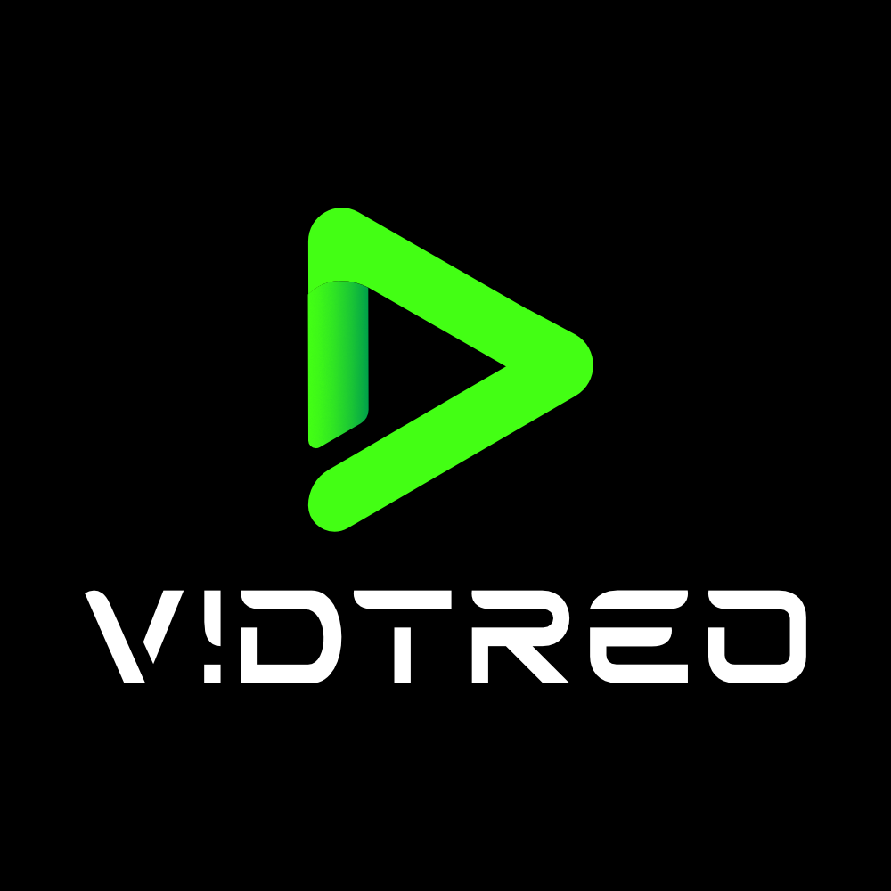

# assignsubmission_vidtreo

`assignsubmission_vidtreo` brings VIDTREO Recorder and VIDTREO Player into Moodle assignments.

This plugin shows where the VIDTREO ecosystem is going: more real integrations, less friction, and better video workflows for edtech teams. Students record inside Moodle. Teachers review inside Moodle. Moodle keeps the submission context, and Vidtreo handles the video infrastructure behind it.

## What this plugin does

- Adds VIDTREO Recorder to the Moodle assignment submission form
- Lets students record and upload a video from the assignment page
- Saves submission metadata in Moodle
- Lets teachers play the submitted recording with VIDTREO Player inside the grading view

## Student flow

1. A student opens an assignment with the Vidtreo submission plugin enabled.
2. Moodle renders the recorder area inside the submission form.
3. The student records a video with VIDTREO Recorder.
4. The recording is uploaded through VIDTREO Edge API.
5. Hidden form fields store the recording metadata.
6. When the student submits the assignment, Moodle saves the metadata and links it to the submission.

## Teacher flow

1. A teacher opens the assignment grading view.
2. Moodle renders the player area for the saved submission.
3. VIDTREO Player loads inside Moodle.
4. The teacher can review playback without leaving the grading screen.

## How it works

At a high level, the plugin follows this flow:

- `locallib.php` builds the submission form and grading output.
- `templates/recorder.mustache` creates the recorder mount point.
- `amd/src/recorder.js` loads the `vidtreo-recorder` web component and listens for upload events.
- Hidden fields such as `vidtreo_recording_id`, `vidtreo_public_id`, `vidtreo_duration`, `vidtreo_status`, and `vidtreo_metadata` carry the result back into Moodle.
- `locallib.php` saves that data into the `assignsubmission_vidtreo` table defined in `db/install.xml`.
- `templates/player.mustache` and `amd/src/player.js` load the `vidtreo-player` web component for grading playback.

Moodle stores the submission metadata and references. The video recording itself lives on Vidtreo infrastructure.

That split is important for edtech. Moodle stays focused on assignments, grading, and course context. VIDTREO handles capture and delivery.

## Key files

- `locallib.php` — main submission plugin logic
- `settings.php` — site-level plugin settings such as API key, backend URL, recorder CDN URL, player CDN URL, and recording options
- `db/install.xml` — database table for submission metadata
- `templates/recorder.mustache` — recorder UI mount point
- `templates/player.mustache` — playback UI mount point
- `amd/src/recorder.js` — recorder integration and hidden field updates
- `amd/src/player.js` — grading playback integration
- `classes/privacy/provider.php` — privacy metadata, export, and deletion hooks

## Installation and setup

1. Copy this plugin into your Moodle assignment submission plugins directory as `mod/assign/submission/vidtreo`.
2. Visit Moodle as an administrator to complete installation.
3. Open the plugin settings and configure:
   - VIDTREO API key
   - Backend URL
   - Recorder CDN URL
   - Player CDN URL
   - Maximum recording time
   - Source switching and pause options
4. In an assignment, enable the Vidtreo submission method.

The current plugin metadata in `version.php` declares:

- Component: `assignsubmission_vidtreo`
- Release: `1.0.0`
- Maturity: `MATURITY_STABLE`

## Data and privacy

The plugin stores submission metadata in Moodle, including the recording ID, public ID, duration, status, and metadata blob.

The privacy provider also declares that recordings are stored on the Vidtreo cloud platform. Deleting data from Moodle removes the Moodle-side records, while the video files remain on Vidtreo infrastructure unless managed there.

## Open source license

This project is open source.

Like the plugin source files, it uses the GNU General Public License, version 3 or later (GPL v3 or later).

That means you can study it, modify it, and share it under the terms of the GPL.
